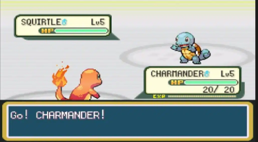

POCKET-ZENA
===

Videogioco a turni ispirato al classico gioco di mostriciattoli tascabili.

I giocatori entrano nel gioco e scelgono il proprio nickname di tre caratteri maiuscoli.
Poi si sceglie tra:
* crea duello
* entra in duello con codice per giocare
* entra in duello con codice come spettatore
* esci

I due giocatori si sfidano a un duello in cui utilizzano tre mostriciattoli fra tutti quelli disponibili.

Il giocatore che riesce a distruggere tutti i mostriciattoli dell'avversario è il vincitore.

I turni sono divisi in due fasi:
* scelta mostriciattolo e attacco tra quelli disponibili del mostriciattolo
* scontro tra due mostriciattoli

Lo scontro tra due mostriciattoli avviene in base alle loro caratteristiche, tipo, alle loro abilità e in base all'attacco scelto dai giocatori.

Lo spettatore deve scegliere per quale giocatore tifare.

L'interfaccia dei giocatori per il duello è indicativamente rappresentata nell'immagine seguente:


L'interfaccia degli spettatori sarà simile a quella del giocatore per cui tifano ma nella fase 1 non vedranno le scelte in corso;
potranno aggiungere delle reazioni che verranno mostrate ai giocatori e agli altri spettatori.

I dati dei mostriciattoli sono raccolti tramite l'API https://pokeapi.co/

Il gioco è realizzato utilizzando Python (FastAPI) e vanilla Javascript.

## Installazione e Avvio

### Prerequisiti
- Python 3.9+
- Pip

### Setup Backend
1. Crea un ambiente virtuale:
   ```bash
   python -m venv venv
   source venv/bin/activate  # Su Windows: venv\Scripts\activate
   ```
2. Installa le dipendenze:
   ```bash
   pip install -r requirements.txt
   ```
3. Avvia il server:
   ```bash
   uvicorn backend.main:app --reload
   ```

### Setup Frontend
Il frontend è composto da file statici nella cartella `frontend/`.
Puoi aprirli direttamente nel browser o servirli tramite un semplice server HTTP (consigliato per evitare problemi di CORS):
```bash
# Esempio usando Python
cd frontend
python -m http.server 8000
```
Assicurati di configurare il proxy o l'URL delle API se necessario.

## CI/CD e Deploy
Il progetto utilizza **GitHub Actions** per l'integrazione continua e il deploy automatico del frontend.
- **CI**: Ad ogni push su `main`, vengono eseguiti i test con `pytest`.
- **Deploy Frontend**: Le modifiche alla cartella `frontend/` vengono pubblicate automaticamente su **GitHub Pages**.

Per istruzioni dettagliate su come pubblicare il backend su **PythonAnywhere**, consulta la [Guida al Deploy](docs/deploy.md).

## Documentazione e Regole
- [Modello Dati](docs/modello-dati.md)
- [Meccaniche di Gioco](docs/meccaniche.md)
- [Logica di Combattimento](docs/logica-combattimento.md)
- [Manuale di Gioco](docs/manuale.md)

## Regole di Gioco (Sintesi)
- Ogni giocatore sceglie 3 mostriciattoli (Zenamon).
- Scontri a turni simultanei.
- Gli spettatori possono tifare e inviare reazioni emoji.

